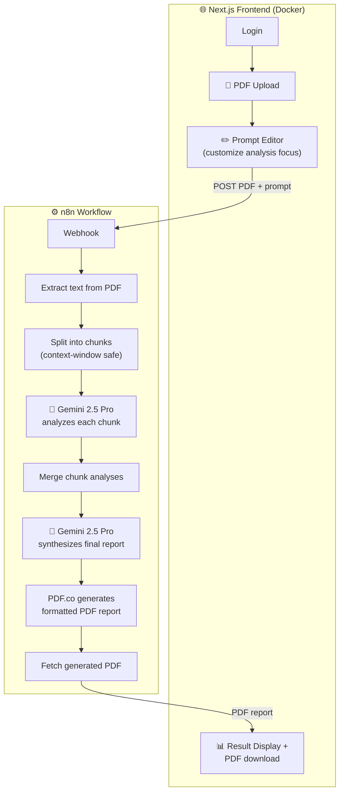

# QC Tool — AI Technical Document Analysis

Upload a technical specification PDF → AI analyzes it chunk by chunk → get back a formatted QC report as a downloadable PDF. Built for quality-control teams reviewing large technical documents.

**Stack:** Next.js + TypeScript + Tailwind (frontend) · n8n (orchestration) · Google Gemini 2.5 Pro (analysis) · PDF.co (report generation) · Docker

---

## The business problem

QC engineers receive technical specification documents that are dozens of pages long. Reviewing each one manually takes hours per document. This tool reduces that to minutes: the AI reads the full document, extracts the technical requirements that matter, and produces a structured QC report.

## Architecture



## Why the chunking design matters

Large technical documents exceed any LLM's practical input for detailed analysis. The workflow:

1. **Splits** the extracted text into chunks that fit comfortably in Gemini's context
2. **Analyzes each chunk separately** — the prompt tells Gemini which chunk it's processing (`chunk 3 of 7`) so it maintains context
3. **Synthesizes** all chunk analyses into one coherent report in a second Gemini pass

This map-reduce pattern handles documents of any size with consistent quality.

## Repository contents

```
├── app/                    ← Next.js app router pages
├── components/             ← FileUpload, PromptEditor, ResultDisplay, LoginForm
├── hooks/useAuth.tsx       ← session handling
├── lib/api.ts              ← n8n webhook client (20-min timeout for large docs)
├── n8n-workflow/
│   └── qc-tool-workflow.json   ← the complete importable workflow
├── Dockerfile + docker-compose.yml
└── DEPLOYMENT_GUIDE.md
```

## Run it yourself

**Backend (n8n):**
1. Import `n8n-workflow/qc-tool-workflow.json` into any n8n instance
2. Connect credentials: Google Gemini (PaLM API) + PDF.co
3. Activate — the webhook goes live

**Frontend:**
```bash
cp .env.example .env.local        # set NEXT_PUBLIC_N8N_WEBHOOK_URL
npm install && npm run dev        # or: docker-compose up
```

## Engineering highlights

- **Map-reduce AI pattern** — chunk-wise analysis + synthesis pass, handles arbitrarily large documents
- **Editable analysis prompt** — QC engineers adjust what the AI focuses on per document type, no code changes
- **20-minute client timeout** — large documents process without the frontend giving up
- **Dockerized** — one `docker-compose up` for reproducible deployment

---

*Production system running in a manufacturing company — sanitized for portfolio use (webhook URLs and credentials replaced with placeholders).*
